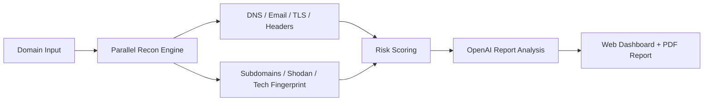

# DomainVitals

See your business through a hacker's eyes.

DomainVitals is an AI-powered attack surface monitor built for non-technical small business owners. Enter a domain, run seven passive recon checks in parallel, and get a clean security report card with plain-English explanations, attacker-perspective narrative, prioritized fixes, and a downloadable PDF you can share with a business partner or IT consultant.

[Screenshot of results dashboard]


## What It Does

- DNS recon: checks A, AAAA, MX, TXT, NS, CNAME, and SOA records for exposure patterns.
- Subdomain discovery: reviews certificate transparency logs for publicly visible subdomains.
- SSL/TLS inspection: analyzes certificate validity, issuer, SANs, and protocol posture.
- Email security review: checks SPF, DKIM, and DMARC configuration quality.
- HTTP header analysis: inspects browser security headers and HTTP-to-HTTPS redirect behavior.
- Open port review: uses Shodan to flag risky internet-facing services when an API key is available.
- Tech stack fingerprinting: identifies visible server, CMS, framework, and version disclosure clues.

DomainVitals is 100% passive. It does not perform intrusive exploitation, brute-force testing, or active vulnerability scanning, which keeps it away from legal gray areas while still surfacing meaningful internet-facing risk.

Results typically return in under 60 seconds.

For live presentations, you can enable `DEMO_MODE=true` and run a polished fictional scan against `demo.threatlens.io` even without live recon access.

## Why It Matters

- 43% of cyberattacks target small businesses.
- 60% of small businesses go out of business within 6 months of a breach.

Small businesses deserve enterprise-grade security visibility without needing an enterprise security team. DomainVitals helps owners understand what an attacker would see first, why it matters, and what to fix next.

## How It Works



Flow: `Domain Input → Parallel Recon → AI Analysis → Report Generation`

## Quick Start

### Prerequisites

- Docker
- An OpenAI API key

### Run It

```bash
git clone https://github.com/yourusername/domainvitals.git
cd domainvitals
echo "OPENAI_API_KEY=your-key-here" > .env
docker-compose up --build
```

Open [http://localhost:3000](http://localhost:3000).

## Tech Stack

| Layer | Technology | Purpose |
| --- | --- | --- |
| Frontend | Next.js 14 + TypeScript + Tailwind CSS + Framer Motion | Responsive scan flow and report dashboard |
| Backend | Python 3.12 + FastAPI | Scan orchestration, APIs, PDF generation |
| AI | OpenAI API (`gpt-4o`) | Plain-English report generation |
| Recon | `dnspython`, `httpx`, `ssl`, `socket`, crt.sh, Shodan | Passive attack surface collection |
| Reporting | ReportLab | Downloadable PDF security report |
| Deployment | Docker, Docker Compose, Vercel, Render | Local and hosted runtime |

## Architecture Notes

- `frontend/` contains the landing page, live scan visualization, and results dashboard.
- `backend/` contains the FastAPI service, scan modules, AI reporter, scoring logic, and PDF generator.
- `docker-compose.yml` wires both services together for local development.
- `backend/render.yaml` and `frontend/vercel.json` support free hosted deployment.

## Deploy Your Own

### Deploy Backend to Render (Free)

1. Push the `backend/` folder to a GitHub repo.
2. Go to Render and create a new Web Service.
3. Connect your GitHub repo and select the backend directory.
4. Render auto-detects the `render.yaml` config.
5. Add environment variables: `OPENAI_API_KEY` (required), `SHODAN_API_KEY` (optional).
6. Set `DEMO_MODE=true` if you want the demo scan available.
7. Deploy and note your URL, for example `https://domainvitals-api.onrender.com`.

### Deploy Frontend to Vercel (Free)

1. Go to Vercel and import your project.
2. Connect your GitHub repo and select the frontend directory.
3. Add environment variable: `NEXT_PUBLIC_API_URL` = your Render backend URL.
4. Deploy and your app is live.

### Post-Deploy Checklist

- Set `ALLOWED_ORIGINS` on Render to your Vercel URL, for example `https://your-app.vercel.app`.
- Test the demo scan by entering `demo.threatlens.io`.
- Test a real domain scan.
- Verify PDF download works.
- Share the Vercel URL in your Codex Creator Challenge submission.

### Important Notes

- Render free tier spins down after 15 minutes of inactivity. The first request after sleep can take around 30 seconds.
- For a pitch demo, hit the backend health check URL about 2 minutes before presenting to wake it up.
- The frontend includes friendly cold-start messaging like “Waking up the server...” for that first slow request.
- Vercel and Render free tiers are more than sufficient for a demo or competition submission.

## Built For

This project was built for the OpenAI x Handshake Codex Creator Challenge (2026).

## Future Roadmap

- Scheduled re-scans with email alerts
- Multi-domain monitoring dashboard
- Compliance mapping (SOC 2, HIPAA, PCI-DSS)
- Browser extension for instant checks
- API for MSP/IT consultant integration

## License

MIT
